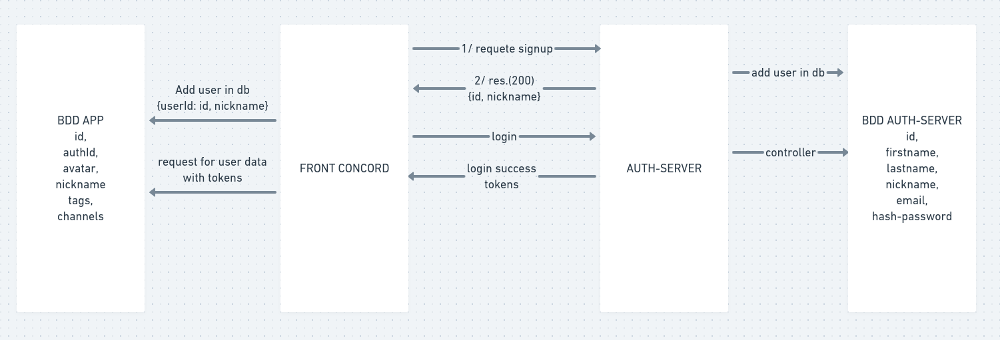

# Journal auth.ikodi

## 22/11/2021 :

* CONCORD :
  - Faire le build du front et le vérifier -> ok
  - Servir le front depuis l'api concord -> ok
  - Cloner le repo api contenant le build du front -> ok
  - Voir si config pm2 ok -> ok
  - Voir si config nginx ok (les ports des app) -> ok
  - Démarrer l'api -> ok
  - Démarrer le front -> ok
  - Tests scenari -> ok
  - Fixer les masters -> après issues soldées.
  - Saisir les issues dans les repos respectifs ->
  - Solder les issues ->

* ISSUES :
  - AUTH : 
    * Lors d'une erreur de mot de passe au login, le nom de l'app origine n'est pas conservé:
      - comportement attendu -> même après des erreurs de saisie dans un formulaire, le login et le signup success devrait rediriger vers l'app d'origine.
    * Il est possible de modifier son email depuis son profil:
      - comportement attendu -> un changement d'email entraine un nouveau signup.
    * _Lors du login avec Google l'utilisateur est redirigé sur auth.ikodi.eu/# :_
      - comportement attendu : L'utilisateur est redirigé sur l'app d'origine.
    * _Lors du login avec github, l'utilisateur est redirigé sur auth.ikodi.eu sans autre action :_
      - comportement attendu : l'utilisateur est redirigé sur l'interface d'authentification de github puis loggué sur l'app d'origine.
  - CONCORD : 
    * Lors de l'update du profil il faut donner aussi l'email si on ne veut changer que le pseudo :
      - Comportement attendu -> pouvoir changer de pseudo sans renseigner l'email et vice-versa.
    * L'utilisateur peut changer son mot de passe pour un non-conforme:
      - comportement attendu -> l'utilisateur devrait recevoir un message l'informant du format attendu pour le mot de passe.
    * Après une suppression de compte, la dernière page visitée s'affiche:
      - comportement attendu : L'utilisateur est redirigé sur la page d'accueil
      NB: Vérifier l'état de la DB dans concord (ok dans auth).

* résolution issues :
  * Lors du login avec Google l'utilisateur est redirigé sur auth.ikodi.eu/#:
    - Modification au niveau front pour envoyer le nom de l'app en query -> ok
    - Modification du googleconnect() pour mettre appaname en cookie -> ok
    - Récupération de appname dans apiLogin -> ok
    - Faire un build et deploy :
      - Fix problématique au niveau du domain des cookies placés par concord-api à "ikodi.eu" au lieu de "concord.ikodi.eu", cela faisait doublon et finissait par provoquer une erreur 'jwt expired'
    - issue résolue et déployée -> ok
  * Lors du login avec github, l'utilisateur est redirigé sur auth.ikodi.eu sans autre action :
    - Modification au niveau front pour envoyer le nom de l'app en query -> ok
    - Récupération de appname dans apiLogin -> ok
    - Faire un build et deploy -> ok

## 21/11/2021

Déploiement : Vite fait le soir j'ai fait et testé le build du front de concord

## 20/11/2021

Déploiement:
* AUTH-server :
  - Création de l'enregistrements DNS -> ok
  - Cloner le repo + faire les builds pour auth-server:
    - augmenter la taille du disque de l'instance -> ok (16Go)
    - Modifier les DNS avec la nouvelle adresse de l'instance -> ok
    - Downgrade la version de node car incompatible avec la version de node-sass -> ok
    - Démarrer le server auth avec pm2 -> ok
    - création des fichiers .env, google_key et github_key pour éviter les erreurs -> ok
    
  - Créer / modifier la base de données PSQL -> ok
  - Paramètrer proxy Nginx ->
    - Ajout de l'upstream dans conf.d/ -> ok
    - Création de la conf dans sites-availables -> ok (attention, la conf auto par certbot ne suffit pas)
    - Certificats pour Https avec certbot -> ok
  - Tests des scenari -> ok
  - Fixer les masters -> ok

## 19/11/2021

- Vérifier les variables relatives pour les urls:
  - Front concord -> ok
  - Back concord -> ok
  - Front auth -> ok
  - Back-auth -> ok
- Régler les inputs de mot de passe et controllers de signup, login, reset, ect. (5 caractères minimum, 50 max, une majuscule, un nombre) ->
  - Ajouter les règles en info bulle :
    - auth front signup -> ok
    - auth front login -> ok
    - auth front reset password -> ok
  - Contrôler ces règles :
    - auth front signup -> ok
    - auth front login -> ok
    - auth front reset password -> ok
    - auth back signup -> ok
    - auth back login -> non fait
    - auth back reset password -> ok
- Vider les champs input pré remplis:
  - auth -> ok
  - concord -> ok
- Faire la chasse aux console.log -> ok
- COMMIT -> ok

## 18/11/2021

Depuis dernier commit :
- Mise en place de l'envoi de mail en cas d'oubli de mot de passe :
  - Mettre en place le flow -> ok
  - Mettre en place l'envoi d'email -> ok
  - Mettre en forme l'email du lien de reset -> ok
  - Mettre en forme le formulaire du lien -> ok
  - Mettre en forme la confirmation du reset -> ok
  - commit -> ok

- Mise en place de la confirmation du mail lors du signup :
  - Ajouter une propriété "active" au model User, default to false, et une prop email-verify qui contiendra un hash JWT_SECRET + email, expiresIn: '10m' -> ok
  - Modifier la query insertUser -> ok
  - Si signup avec info complètes, envoyer un email à l'adresse donnée avec un lien vers le serveur get('/email-verify/:id/:token) -> ok
  - Réceptionner le lien -> ok
  - Vérifier le token avec celui du user ayant l'id fourni -> ok
  - Si ok, passer la prop active du user à true, passer email-verify à null -> ok
  - Conditionner le login à user.active = true -> ok
  - Mise à jour des scénarios à tester et réalisation des scénarios de test -> ok
  - commit -> ok
- Revoir le front concord :
  - profile -> ok
  - users in channel -> ok
  - commit -> ok

## 17/11/2021

- Tests globaux de concord avec auth-server -> ok
  - Fix bug sur logout quand jwt expired -> ok
- Fixer les versions sur github -> 
  - back concord -> ok sur develop, en attente fin front pour merge sur master,
  - front concord -> ok sur develop, en attente reprise visuelle Profile et Channel pour merge sur master,
  - back/front auth -> ok sur develop, sur master après send mail.

## 16/11/2021

- Fix bug le get /me initial depuis concord non fonctionnel -> ok  
- Mettre en place la redirection vers l'app depuis Loginform -> ok
- Compléter la redirection vers l'app depuis Signupform -> ok
* C'est auth-server qui doit rediriger la response pour concerver les tokens :
  - Modifier le submit du formulaire, pas d'ajax pour que la requête puisse être redirigée avec les tokens -> ok
  - Mettre en place le redirect pour apilogin en middleware -> ok
  - Mettre en place le redirect pour login depuis formulaire -> ok
  - Mettre en place le redirect pour signup depuis formulaire -> ok    
- Tests globaux de auth-server ->ok
- Fixer les versions sur github -> ok

Appris :
* Les requêtes Ajax ne permettent pas une redirection de la requêtes, cependant un envoi de formulaire basic le permet, sauvé... mais ça change pas mal au niveau de transport des messages.

## 15/11/2021

* Mise en place du login avec Github -> ok
* Mise en place login Google sur le modèle Github -> ok
  - Faire en sorte de rediriger vers auth.ikodi.eu pour faire le login/signup -> ok
  - refaire une authentification avec route /google/auth -> ok
* Factoriser les authentifications avec une api (google, github, des autres plus tard ?) -> ok
* Fix bug pas de nom avec login google -> ok
* Ajouter une colonne apisignup en DB, default false -> ok
* Conditionner le message d'erreur au login à cette prop dans les controllers login via form et via api -> ok

Ce que j'ai appris :
- Fonctionnement du flow OAuth mieux compris,

## 14/11/2021

Fin de la mise en place de login et signup avec Google api, 

Ce que j'ai appris :
* Faire un bon schéma, c'est bien.
* Rappel sur google platform,
* Rappel sur express, redirect et utilisation des middlewares chainés,

## 13/11/2021

* Modification des controller dans auth-server et concord-server pour utiliser le jwt payload plutôt que req.body.
* Fix des derniers bugs et tests navigateur ok, notamment la création d'un compte en dehors de concord permet de se logguer à concord avec un compte :))
* Mise à jour des tests d'intégration avec user details dans le jwt

## 12/11/2021

Bon aujourd'hui, fin de la partie raccordement de concord !

* Fix bug avec input pseudo dans Profile ->
* Update tags -> ok
* Update avatar -> ok
* get my channels -> ok
* get my recommended channels -> ok
* update pwd -> ok
* chatrooms fonctionnent -> ok
* deleteMe -> ok

* Revoir l'organisation des repos pour le déploiement -> pas pour l'instant, on verra avec docker plus tard.

Ce que j'ai appris : 
* Une utilisation plus efficace des jwt, notamment pour transporter des infos,
* L'extraction de données de la base vers un fichier csv (COPY ... TO...),

## 11/11/2021

* Connecter Concord,
  - Reprendre les tests en incluant bien concord-api -> ok, reste l'avatar -> ok
  - Après tests ok, transposer au niveau app-front -> ok
  - update mail :
    - ajouter un formulaire de saisie du nouvel email et pseudo + mdp -> ok
    - relier à l'action UPDATE_PROFILE -> ok
    - c'est tout bon -> ok
  - update pseudo -> ok
* Faire un script de création de la base de auth-server cohérent avec celui de concord-server -> ok
* Modifier celui de concord-server en supprimant les données redondantes (nickname, email) -> ok

* Ce que j'ai appris :
  - Même si cela semble "simple" dès qu'il y a modification de structure de base de données, il vaut mieux reprendre les MCD et se poser des questions puis élaborer un plan avant de faire des modifs, pas coder à fond direct...
  - Revu react avec redux et composants,

* Flux des requêtes entre les servers et bases de données:

## 10/11/2021

* Modification côté auth-server :
  - Seuls email et password obligatoire lors du signup, rendre obligatoire au moins un des "firstname", "lastname", "nickname", rq: les autres éventuelles info devront être stockées dans la bdd de l'app ->ok
  - signup depuis le front -> ok
  - login depuis le front -> ok
  - les channels et tags sont reçus et dispo -> ok
  - page discovery s'affiche bien -> ok
  - page chatroom s'affiche bien -> ok
  - page home s'affiche bien (bonnes infos) :
    * Il faut créer un user sur auth-server et l'enregistrer aussi dans l'api concord :
      - Ajout d'un champ 'authid' dans le modèle User de Concord -> ok
      - Modification du script db-generate.js pour en tenir compte, créé les authid jusqu'à 27 -> ok, une erreur significative corriguée pour la création des channels (un debug de 1h quand même...) et une perte de temps d'une heure supplémentaire sur un truc qui marchait très bien (fuck l'affichage de la table dans le terminal...)
      - Modification du script create.sql sur auth-server pour commencer les id à 30 -> ok
      - Modifier les requêtes du front concord par rapport à authId :
        - Faire séparation claire entre requêtes à auth-server et api-concord, deux middlewares bien séparés -> ok
        - Après un signup success (auth-server), le front créé un profil dans sa base (concord-server) :
          - Reprendre les tests en incluant bien concord-api -> ok, reste l'avatar,
          - Après tests ok, transposer au niveau app-front -> à faire
          
* Ce que j'ai appris :
  - Les tests ça prend du temps à mettre en place (encore que avec l'habitude) et finalement ça fait gagner du temps,
  - J'ai revu sequelize, c'est bien,
  - Meilleur compréhension du flux des requêtes entre plusieurs serveurs.

## 09/11/2021

Fait :
* Modification des routes (légères) dans auth-server pour séparer la logique d'identification liée aux identifiants (email / password / firstname / lastname) de l'accès au contenu du profil de chaque utilisateur (avatar / tags / channels / recommended / ...)
* Mise en place des tests d'integration pour l'api de concord + réorganisation des tests.

Ce que j'ai appris :
* Une meilleur connaissance des tests avec mocha, jouer avec les callbacks ça peut être marrant...

## 08/11/2021

Fait :
- Le formulaire de login renvoi les messages d'erreur prévu -> ok,
- Le formulaire de login renvoit les jwt en cookie httponly -> ok,
- Le formulaire de création de compte renvoi les erreurs prévues -> ok,
- Le formulaire de création de compte permet de créer un compte -> ok
- Le login success redirige vers ikodi.eu (en attente de récup de l'app d'origine) -> ok
- Le signup success fait ensuite le login -> ok

Ce que j'ai appris :
- Avec une bonne préparation, tout est plus simple :-)
- Le fait d'avoir passé du temps sur les tests me fait clairement gagner du temps ici (même si quand même c'est overkill pour une petite app comme ça).

## 07/11/2021

Fait :
- Fin des tests de composants (initiaux) de l'app Vue,

Ce que j'ai appris :
- A faire des tests sur les composants Vue, plus compliqué qu'il n'y parait d'autant qu'il faut tester le résultat affiché plutôt que les props ou les méthodes.
- Bon côté, c'est probablement quasi identique avec React,

Prochaines étapes :
- Connexion serveur avec le front Vue,

## 05/11/2021

Fait :
- config du projet pour utiliser vue-test-utils avec chai -> ok
- tests du composant LoginForm.vue -> ok

Ce que j'ai appris :
- C'est la galère à configurer, à ce stade avec Vue il y a des incompatibilités de version entre vue2 / vue3 et vue-utils. ESLint, c'est la galère aussi pour les mêmes raisons.
- Utiliser vue-cli pour paramétrer le projet c'est beaucoup plus efficace car tout est prévu compatible direct. D'ailleur recréer un projet avec les bons params et copier-coller le dossier src semble fonctionner rapidement.

Prochaines étapes :
- Finir de mettre en place les tests des composants Vue,

## 04/11/2021

Choix librairie de tests composants Vue3 -> https://testing-library.com/docs/vue-testing-library/examples

## 03/11/2021

Mise en place DELETE /me, tests d'intégration + jwt.verify, redis.verify -> ok
Mise en place PUT /me, tests d'intégration + jwt.verify, redis.verify -> ok
Mise en place PUT /me/password, tests d'intégration + jwt.verify, redis.verify -> ok
Mise en place de tests unitaires sur services de l'api (fonctions jwt et redis), -> ok

## 02/11/2021 ()

Mise en place GET /me, tests d'intégration ok (login with access_token and refresh_token);
Mise en place de redis pour stockage info logout,
Loggout : route + redis -> ok
Mise en place /me pour récup infos perso fonctionnel avec JWT et logout.

## 01/11/2021 (environ 3h / jour depuis la dernière entrée, 6h aujourd'hui)

L'app express est en place, la base postgreSQL est créée (avec script create.sql) et connectée à l'app express avec queries async/await.
Les premières routes sont créées, notamment /signup, /login, 
Les tests d'intégration sont en place et utilisés façon TDD.
Cryptage du mot de passe + tests (bcrypt),
Mise en place des JWT + cookiehttponly avec tests d'intégration,

## 28/10/2021

Le landing est fait avec composants et tout et tout, modals quasi finies mais je viens de tomber sur un exemple d'authentification par techno blockchain avec web3.js, je vais donc me renseigner d'avantage sur la faisabilité même si ça semble réservé aux apps décentralisées. -> pour app sur blockchain uniquement ou alors avec paiement de gas fee donc voilà...

## 25/10/2021 (9h - 10h)

Fin des wireframes.

## 24/10/2021 (2h)

Création du README.md, réflexion sur l'architecture globale dans le whimsical.
Début du wireframe selon modèle de Topics.
Création du repo et du projet dans repo github.

Demain: Continuer les wireframes.